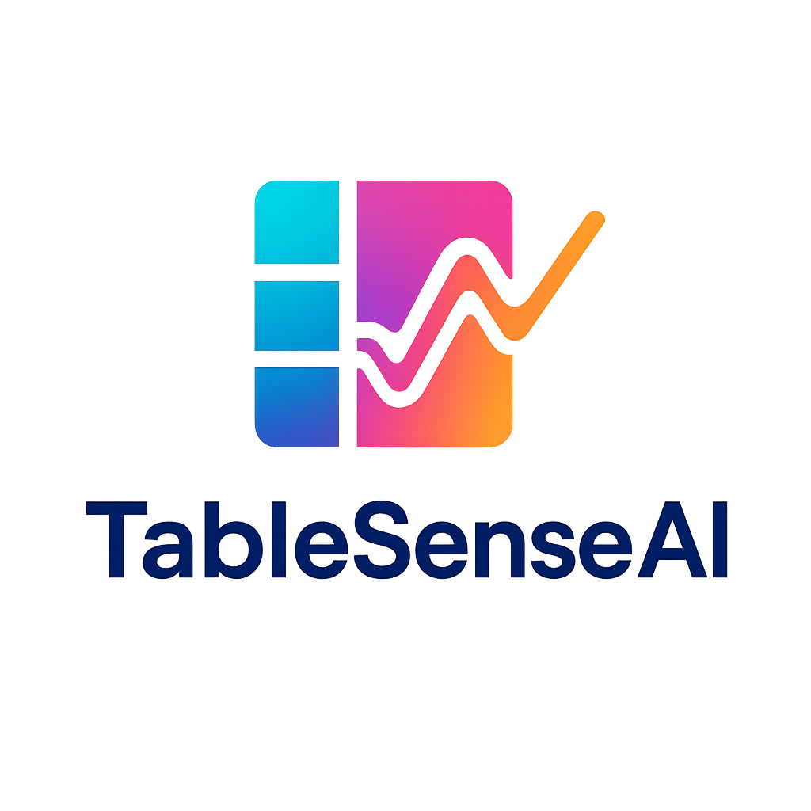

# Introductio

TableSense-AI provides a fully functioning RAG-System that aims to improve on handling tabular data.

## Setup

Run docker compose up

## Access to UI
The ui is accessible under localhost:8501 

## Access to periferal UI
the milvus web ui is accessible under localhost:9091/webui

## Common Errors

If the milvus database is firing errors then it can help to
docker volume prune
and also 
remove all volumes created in the docker compose